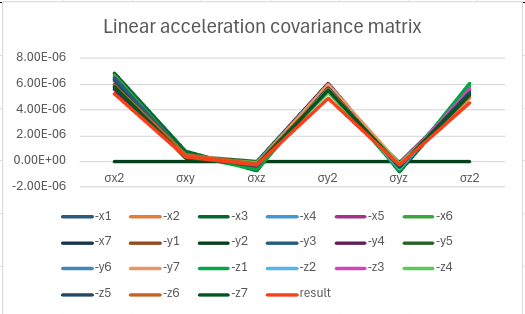

# ROS2 Write IMU Covariance Matrix
## Installation
```
cd your_ros_package_path/src
git clone --recurse-submodules https://github.com/Deep-In-Sight/IMUCovarianceMatrixROS2.git
colcon build --packages-select imu_covariance
```
### How to run
1. Run IMU Publisher First
2. ```ros2 run imu_covariance imu_covariance_node iteration file_name imu_topic_name```

#### Default option
- iteration : 100
- file_name : covariance_matrix.txt
- imu_topic_name : imu/data

## Result - [LPMS-RS232AL3](https://www.lp-research.com/imu/lpms-al3/)



